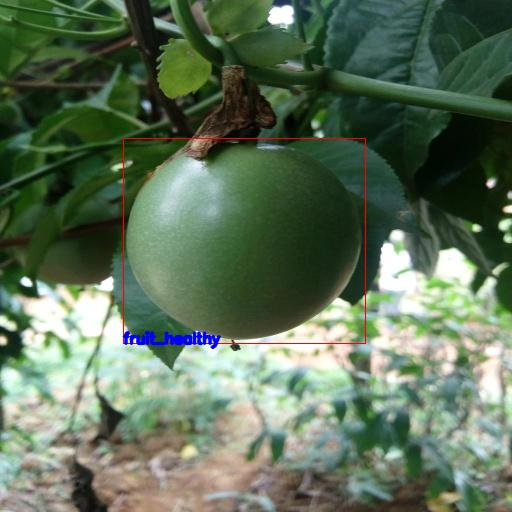

# Passion Fruit Disease Detection

I tried to create an accurate machine learning models capable of localizing and identifying multiple Passion Fruits in a single image, and classify the disease status of those fruits. For this task, i used Faster-Rcnn to detect the fruits, and Streamlit to create a web app for this task. This model is quite successful knowing that creating accurate machine learning models capable of localizing and identifying multiple objects in a single image remains a core challenge in computer vision. 

 

### Wep App:

  <a href="https://share.streamlit.io/ttaha09/passion-fruit-disease-detection/main/main.py" rel="nofollow noreferrer">
     Passion Fruit Disease Detection
  </a> &nbsp;
 

### Connect with me:

  <a href="https://www.linkedin.com/in/taha-tamir-351272145/" rel="nofollow noreferrer">
     LinkedIn
  </a> &nbsp;
 

 
